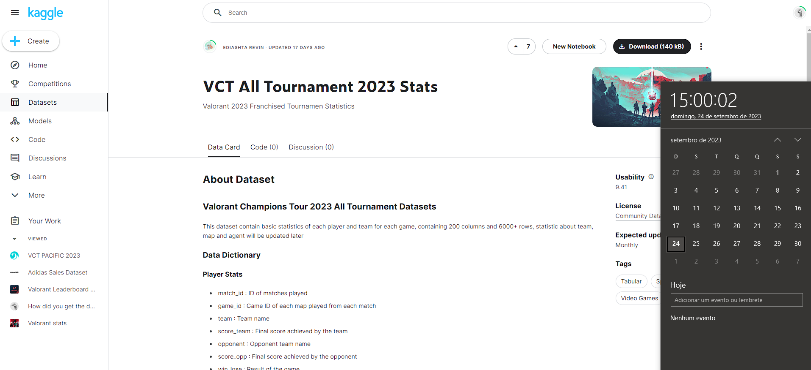

  

  <h3 align="center">
    Valorant Overview
  </h3>
  

    <a href="https://github.com/viniciusgugelmin/data-science-4/blob/master/README.md"><strong>Explore the docs »</strong></a>
  

  
<h2 style="display: inline-block">📜 Abstract</h2>

- [About The Project](#about-the-project)
- [Source](#source)

## 📋 About The Project

**(Portuguese)**

TODO description

**(English)**

TODO description

## 🔗 SOURCE

**(Portuguese)**

- **Nome original do projeto**: Valorant Overview
- **Disponível em**: https://www.kaggle.com/datasets/ediashtarevin/vct-champions-2023-stats
- **Baixado em**: 24/09/2023 15:00
- **Imagem**:
  

**(English)**

- **Original project name**: Valorant Overview
- **Available at**: https://www.kaggle.com/datasets/ediashtarevin/vct-champions-2023-stats
- **Downloaded at**: 09/24/2023 15:00